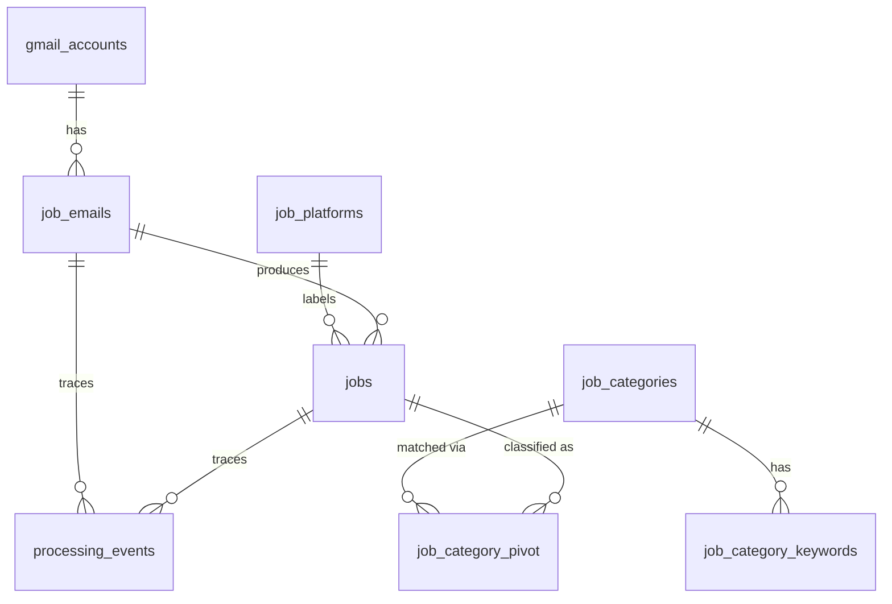

# Job Automation

Structured job discovery from two independent sources — **Gmail job-alert emails** and a
**LinkedIn job-search scraper** — with normalization, freshness filtering, keyword-based
classification, and fingerprint deduplication.

- **Backend:** Python 3.12, FastAPI, SQLAlchemy 2.x, Alembic, Celery + Celery Beat, Redis, MySQL (SQLite supported for local dev/tests)
- **Frontend:** Vue 3, Vite, TypeScript, Tailwind CSS v4, Pinia, Vue Router, Axios
- **Gmail:** Google OAuth 2.0 (PKCE), `gmail.readonly` scope only
- **Scraper:** Playwright (headless Chromium) against LinkedIn guest job search

---

## Overview

`job-automation` ingests job-alert emails (LinkedIn, Indeed, Wellfound, Glassdoor, and
unrecognized senders) from a user's Gmail inbox, extracts structured job postings from each
email, filters out stale postings, classifies jobs against configurable keyword categories,
deduplicates them, and persists the results. A separate pipeline scrapes LinkedIn job-search
results in a headless browser and stores them in their own table. A Vue 3 dashboard displays
both streams and lets the user trigger Gmail syncs, backfills, and LinkedIn scrapes.

**Scope boundary (as designed and implemented):** this system reads Gmail and scrapes LinkedIn
search results, then produces structured job data. It does **not** submit applications, fill
forms, upload resumes, or automate browser actions on other sites.

**Important:** Gmail job-alert emails are treated as the user's own filtered job source.
There is no AI-based relevance ranking of incoming emails — classification is a
**rule-based keyword matcher** (see [AI / LLM](#ai--llm)).

---

## Problem Being Solved

Manually reviewing dozens of daily job-alert emails is tedious, and interesting postings get
lost. This project:

1. Pulls job-alert emails automatically via Gmail OAuth (read-only).
2. Extracts one job per posting from **multi-job digest emails** (a 10-job digest yields up to 10
   jobs, not 1, and never mints garbage jobs from footer noise).
3. Distinguishes the **job posting date** from the email's received date, using the email's own
   received time as the reference so delayed processing never rewrites history.
4. Drops postings older than a configurable window and never fabricates a posting date.
5. Classifies jobs against user-customizable categories (seeded with PHP, Laravel, Backend, AI,
   LLM, Python, OpenCart, Machine Learning, Generative AI).
6. Deduplicates by a deterministic fingerprint (platform + canonical job URL) so the same job
   arriving via repeated daily alerts is stored once.
7. Additionally lets the user scrape LinkedIn job-search results for arbitrary keyword/location
   filters without logging in.

---

## Key Features

| Feature | Description |
| ------- | ----------- |
| Gmail OAuth 2.0 (PKCE) | Connect a Gmail account with the least-privilege `gmail.readonly` scope. Tokens encrypted at rest (Fernet). |
| Gmail ingestion | Lookback-window Gmail search, email normalization, per-message dedup, optional processed label, scheduled + manual sync. |
| Platform parsers | LinkedIn, Indeed, Wellfound, Glassdoor + generic fallback; multi-job digest segmentation. |
| Structured signals | Remote type, salary, employment type extracted only when the email states them (NULL = not stated). |
| Freshness policy | `MAX_JOB_AGE_HOURS` window measured against `job_posted_at`; explicit `UNKNOWN_DATE_POLICY` for un-datable jobs. |
| Classification | Database-driven categories/keywords with word-boundary matching and negative keywords. No LLM. |
| Deduplication | SHA-256 fingerprint of platform + canonical job URL (platform ID or title+company as fallback). |
| Processing audit trail | `processing_events` records parse/classify/duplicate/filter outcomes per email. |
| LinkedIn scraper | Playwright headless browser, bounded scroll, one-card-one-job parsing, keyword/location/date filters, own table. |
| Backfill | Re-processes already-ingested emails that predate the pipeline or failed, one-shot per email. |
| Dashboard + Scraper UI | Vue 3 views for job lists, Gmail connection/sync/backfill, and LinkedIn scrape controls. |

---

## Architecture

```text
                    ┌─────────────────────────────────────────────────────┐
                    │                    Frontend (Vue 3)                │
                    │   Dashboard  (/)      Scraper  (/scraper)           │
                    │   Pinia stores ── Axios ──► REST /api              │
                    └───────────────────────┬─────────────────────────────┘
                                            │ HTTP (CORS: localhost:5173/5174)
                                            ▼
                    ┌─────────────────────────────────────────────────────┐
                    │                Backend (FastAPI, :8000)            │
                    │  /api/gmail/*      /api/jobs      /api/scraper/*    │
                    │  /api/health      /api/health/db                    │
                    │                                                     │
                    │  GmailIngestionService ── JobProcessingService      │
                    │  LinkedInScraperService (Playwright)                │
                    └───────┬──────────────────────────┬──────────────────┘
                          ▼                            ▼
                    SQLAlchemy 2.x               Celery worker / Beat
                            │                    (Redis broker + results)
                            ▼
                    MySQL (Docker) / SQLite (local dev)
```

### Component responsibility

| Component | Responsibility |
| --------- | -------------- |
| **FastAPI app** (`backend/app/main.py`) | HTTP API, CORS, wiring of health/gmail/jobs/scraper routers. |
| **Gmail OAuth** (`app/gmail/oauth.py`) | Authorization URL (PKCE S256), token exchange, token refresh, `gmail.readonly` + `openid` + `userinfo.email`. |
| **Gmail client / normalizer** (`app/gmail/`) | Thin Gmail API transport; converts raw `messages.get` payloads into `NormalizedEmail`. |
| **Gmail ingestion service** (`app/gmail/service.py`) | Search → dedup → ingest → run full job pipeline → label → mark processed; backfill. |
| **Platform parsers** (`app/job_alerts/parsers/`) | Understand each platform's email layout; registry picks the first `supports()` parser (generic last). |
| **Extraction services** (`app/job_alerts/extraction/`) | Job-posting date extraction, job-URL extraction/scoring, canonical URL + job-ID normalization, SSRF-safe redirect resolver (standalone; not yet wired into ingestion). |
| **Classification** (`app/job_alerts/classification/`) | `RuleBasedClassifier` — word-boundary keyword matching against DB categories. |
| **Job processing pipeline** (`app/jobs/services/job_processing_service.py`) | Parse → normalize/validate → freshness filter → classify → fingerprint dedup → persist. |
| **Repositories** (`app/repositories/`) | Data access for accounts, emails, platforms, jobs + processing events. |
| **LinkedIn scraper** (`app/job_scraper/`) | Playwright browser fetch, card parsing, normalize/dedup/filter, persistence to `scraped_jobs`. |
| **Celery** (`app/tasks/`) | Scheduled Gmail sync (`Beat`), `scrape_linkedin` task (not scheduled), `ping` example task. |
| **Frontend stores/views** (`frontend/src/`) | Pinia stores (overview, emails, jobs, scraper) calling the REST API; two views. |

---

## Technology Stack

| Layer | Technology |
| ----- | ---------- |
| Backend | Python 3.12 (target; local venv uses 3.14), FastAPI, Uvicorn, Pydantic v2 + pydantic-settings |
| ORM / migrations | SQLAlchemy 2.x, Alembic (5 migrations), PyMySQL |
| Data stores | MySQL 8.4 (Docker Compose), Redis 7 (broker/backend), SQLite for tests & local dev |
| Queues | Celery >=5.4 + Celery Beat, `redis` client |
| Gmail | google-api-python-client, google-auth, google-auth-oauthlib, cryptography (Fernet) |
| Parsing | BeautifulSoup4, python-dateutil, httpx (redirect resolution) |
| Browser automation | Playwright (chromium, headless by default) |
| Frontend | Vue 3, Vite 8, TypeScript, Tailwind CSS v4, Pinia, Vue Router, Axios |
| Quality/tests | pytest, pytest-asyncio, ruff, mypy, black |

---

## System Workflow

### Gmail job alerts (implemented end-to-end)

```text
Gmail job-alert email
      ↓  Google OAuth (gmail.readonly) + lookback-window search
Email fetch + normalization (NormalizedEmail)
      ↓
Platform detection (sender-domain match) → JobEmail (dedup: account+message_id)
      ↓
ParserRegistry → platform parser (LinkedIn/Indeed/Wellfound/Glassdoor/Generic)
      ↓  multi-job digest → N NormalizedJob candidates
JobNormalizer  (clean fields, canonical URLs, job IDs, validate — reject with event)
      ↓
FreshnessPolicy  (MAX_JOB_AGE_HOURS vs job_posted_at; UNKNOWN_DATE_POLICY)
      ↓
RuleBasedClassifier  (database keyword categories → RELEVANT / IRRELEVANT)
      ↓
JobFingerprintService → existing job? record DUPLICATE event and enrich : insert new Job
      ↓
jobs + job_category_pivot + processing_events  → Dashboard GET /api/jobs
```

### LinkedIn scraper (implemented end-to-end, experimental on live site)

```text
User filters (keyword / location / date / type / workplace)
      ↓  build_linkedin_search_url (LinkedIn filter tokens f_TPR / f_JT / f_WT)
Headless Chromium (Playwright) → search HTML (bounded scroll passes)
      ↓
parse_jobs_html — one job per card (never per link)
      ↓
Normalize (canonical URL, posted_at vs scraped_at) → dedup by job_id / canonical URL
      ↓
Keyword relevance filter (title first; job-detail page fetch fallback)
      ↓
Location filter → own posted-age validation → SCRAPER_MAX_CARDS bound
      ↓
scraped_jobs table (source='linkedin_scraper') → Dashboard /api/scraper/jobs
```

---

## Project Structure

```
job-automation/
├── README.md
├── docker-compose.yml            # mysql, redis, backend, celery_worker, celery_beat
├── .env.example                  # all documented configuration keys
├── job_automation.db             # ⚠ stray SQLite artifact, accidentally committed to git
├── backend/
│   ├── Dockerfile                # python:3.12-slim (no Playwright browsers installed)
│   ├── requirements.txt
│   ├── pyproject.toml            # black/ruff/mypy/pytest config (targets Python 3.12)
│   ├── alembic.ini
│   ├── alembic/
│   │   ├── env.py                # imports all models; URL from app settings
│   │   └── versions/             # 5 migrations (Phase 1, Phase 2-5, Glassdoor,
│   │                             #   structured signals, LinkedIn scraper)
│   ├── app/
│   │   ├── main.py               # FastAPI entrypoint, CORS, router wiring
│   │   ├── api/routes/           # health.py, gmail.py, jobs.py, scraper.py
│   │   ├── config/settings.py    # env-driven configuration (pydantic-settings)
│   │   ├── database/             # SQLAlchemy engine/session, declarative Base
│   │   ├── security/             # Fernet token encryption (SECRET_KEY-derived)
│   │   ├── gmail/                # oauth, client, normalizer, html_text, service
│   │   ├── job_alerts/
│   │   │   ├── contracts/        # JobPlatformParser protocol
│   │   │   ├── dto/              # NormalizedJob
│   │   │   ├── detection/        # empty placeholder (platform detection is done
│   │   │   │                     #   via sender-domain match in repositories)
│   │   │   ├── extraction/       # date extractor, URL extractor, URL normalizer,
│   │   │   │                     #   redirect resolver (unwired)
│   │   │   ├── normalization/    # job_normalizer.py, freshness.py
│   │   │   ├── classification/   # rule_based_classifier.py, contracts.py
│   │   │   └── parsers/          # {linkedin, indeed, wellfound, glassdoor, generic}/, registry.py
│   │   ├── jobs/
│   │   │   ├── models/           # Job, JobEmail, JobPlatform, JobCategory,
│   │   │   │                     #   JobCategoryKeyword, ProcessingEvent, enums
│   │   │   ├── fingerprinting/   # JobFingerprintService
│   │   │   ├── services/         # JobProcessingService
│   │   │   └── export/           # empty placeholder (CSV export not implemented)
│   │   ├── job_scraper/          # browser.py, card_parser.py, service.py,
│   │   │                         #   repository.py, search_url.py, models.py, schemas.py, dto.py
│   │   ├── repositories/         # gmail_account, job_email, job_platform, job
│   │   ├── schemas/              # Pydantic request/response models (gmail, jobs, scraper)
│   │   └── tasks/                # celery_app.py, gmail_tasks.py, scraper_tasks.py, example_task.py
│   └── tests/
│       ├── conftest.py           # FastAPI TestClient + in-memory SQLite session
│       ├── fixtures/             # linkedin/indeed/glassdoor/wellfound email fixtures
│       ├── unit/                 # parsers, extractors, classifier, freshness, fingerprint, ...
│       └── integration/          # gmail ingestion, processing pipeline, jobs route, backfill
└── frontend/
    ├── package.json              # vue, pinia, vue-router, axios, tailwind, vite
    ├── vite.config.ts            # dev server port 5173, tailwind + vue plugins
    └── src/
        ├── main.ts, App.vue
        ├── router/index.ts       # '/' Dashboard, '/scraper' Scraper
        ├── services/api.ts       # axios instance (VITE_API_BASE_URL, default :8000/api)
        ├── stores/               # overview.ts, emails.ts, jobs.ts, scraper.ts (Pinia)
        └── views/                # DashboardView.vue, ScraperView.vue
```

---

## Database

Five Alembic migrations create 10 tables. Primary deployment target is MySQL (Docker);
tests and local dev commonly use SQLite.

### Tables (from migrations)

| Table | Purpose | Notes |
| ----- | ------- | ----- |
| `gmail_accounts` | Connected Gmail accounts | Encrypted access/refresh tokens (`access_token_encrypted`, `refresh_token_encrypted`), `token_expires_at`, `user_id=1` (single user), `history_id` reserved for future incremental sync |
| `job_platforms` | Database-driven source registry | Seeded: LinkedIn, Indeed, Wellfound (Phase 1), Glassdoor (migration 3); `parser` column reserved for parser path |
| `job_emails` | Discovered job-alert emails | Unique `(gmail_account_id, gmail_message_id)` → message-level dedup; SHA-256 `raw_hash` of normalized content |
| `jobs` | Persisted, normalized jobs | `fingerprint` unique → job-level dedup; `platform_id` nullable; `job_posted_at` nullable (never fabricated); `status` |
| `job_categories` | Configurable categories | Seeded: PHP, Laravel, Backend, AI, LLM, Python, OpenCart, Machine Learning, Generative AI |
| `job_category_keywords` | Keywords per category | `match_type` enum: exact / word_boundary / synonym / negative (default word_boundary) |
| `job_category_pivot` | M:N join jobs ↔ categories | Also stores `confidence` and `matched_by` (= `rules`) |
| `processing_events` | Pipeline audit trail | `job_email_id`, `job_id`, `event_type`, `status`, `message`, JSON `metadata` |
| `scraped_jobs` | LinkedIn scraper results | `source='linkedin_scraper'`; unique indexes on `job_id` and `job_url`; separate from Gmail-derived jobs |
| `alembic_version` | Alembic bookkeeping | — |

Additional `jobs` columns: `remote_type`, `salary`, `employment_type` (nullable, only set when the email states them).

### Entity-relationship diagram



`scraped_jobs` has **no relationships** — it is intentionally a standalone table with no
foreign keys, so it appears in the diagram only in the Project Structure / tables list.

Foreign keys that exist in code:
- `job_emails.gmail_account_id → gmail_accounts.id`
- `jobs.job_email_id → job_emails.id` (NOT NULL)
- `jobs.platform_id → job_platforms.id` (nullable)
- `job_category_keywords.job_category_id → job_categories.id`
- `job_category_pivot.job_id → jobs.id`, `job_category_pivot.job_category_id → job_categories.id`
- `processing_events.job_email_id → job_emails.id`, `processing_events.job_id → jobs.id` (both nullable)

`scraped_jobs` deliberately has **no foreign keys** — it lives apart from the Gmail-derived data.

---

## API

All endpoints are mounted under `/api` and are **unauthenticated** (the backend assumes a
single user). OpenAPI docs are available at `http://localhost:8000/docs`.

| Method | URL | Purpose |
| ------ | --- | ------- |
| GET | `/api/health` | Liveness check — returns `{"status": "ok"}` |
| GET | `/api/health/db` | Checks DB connectivity — `{"status": "ok", "database": "reachable"}` |
| GET | `/api/gmail/oauth/authorize` | Returns Google consent URL + state for the dashboard redirect |
| GET | `/api/gmail/oauth/callback?code=…&state=…` | Google OAuth callback; exchanges code (PKCE), upserts the account, returns account JSON |
| GET | `/api/gmail/accounts` | Lists connected accounts (tokens never exposed) |
| POST | `/api/gmail/sync` | Runs ingestion for every connected account, returns per-account sync stats |
| GET | `/api/gmail/emails?limit=50` | Lists recently discovered job emails |
| POST | `/api/gmail/backfill` | Re-fetches/reprocesses ingested emails that never produced a Job row |
| GET | `/api/jobs?page=1&page_size=20` | Paginated jobs (any status), newest received first |
| POST | `/api/scraper/linkedin/run` | Runs a LinkedIn scrape synchronously (browser runs during the request) |
| GET | `/api/scraper/jobs?limit=50` | Recent scraped jobs, newest first |

### Examples

```http
GET /api/jobs?page=1&page_size=20
```

```json
{
  "items": [
    {
      "id": 2,
      "title": "PHP Laravel Developer",
      "company": "Cynosure Designs · Lahore",
      "location": null,
      "source": "linkedin",
      "job_url": "https://www.linkedin.com/jobs/view/…",
      "application_url": null,
      "categories": ["PHP", "Laravel", "Backend"],
      "job_posted_at": "2026-09-17T05:40:00Z",
      "received_at": "2026-09-17T05:49:19Z",
      "status": "RELEVANT",
      "remote_type": "remote",
      "salary": null,
      "employment_type": null
    }
  ],
  "total": 7,
  "page": 1,
  "page_size": 20,
  "total_pages": 1
}
```

```http
POST /api/scraper/linkedin/run
Content-Type: application/json

{"keyword": "PHP Developer", "location": "Pakistan", "date_posted": "past_24_hours", "job_type": "any", "workplace": "any"}
```

Response: `{source, search_url, total_found, saved, duplicates, filtered_by_date, errors, jobs, scraped_at, message}`.
Scraper/browser/rate-limit failures return HTTP **502** with an explanatory `detail`.

```http
POST /api/gmail/sync
```

Response: array of `{account_email, messages_found, messages_ingested, messages_skipped_duplicate, messages_failed}`.

**Notable errors:** `GET /api/gmail/oauth/callback` returns `400` for invalid/expired OAuth state,
failed token exchange, or a missing refresh token. `POST /api/scraper/linkedin/run` returns `502`
for `LinkedInScraperError` (browser launch, LinkedIn unavailable, login/rate-limit wall).

---

## Frontend

A Vue 3 single-page app (Vite dev server on **port 5173**) served independently of the API.

| Route | View | Contents |
| ----- | ---- | -------- |
| `/` | Dashboard (`DashboardView.vue`) | Backend connectivity check; Gmail account status + "Connect Gmail" (redirects to Google consent); "Sync Now" and "Backfill Jobs" buttons; paginated jobs table (title, company, source, categories, posted, received, link) with per-browser visited-link tracking (localStorage); last-sync summary |
| `/scraper` | Scraper (`ScraperView.vue`) | LinkedIn filters (keyword, location, date posted, job type, workplace), "Scrape LinkedIn Jobs" button, scrape progress/error, results table with saved/duplicate/date-filtered counts |

**State management:** four Pinia stores call the shared axios client
(`frontend/src/services/api.ts`), whose base URL is `VITE_API_BASE_URL` (default
`http://localhost:8000/api`):

- `stores/overview.ts` → `GET /api/health`
- `stores/emails.ts` → `GET/POST /api/gmail/accounts|emails|sync|backfill`
- `stores/jobs.ts` → `GET /api/jobs` (pagination, visited-URL tracking in localStorage)
- `stores/scraper.ts` → `POST /api/scraper/linkedin/run`

There is no frontend authentication layer; the app assumes a single local user.

---

## Gmail Integration

### Authentication

- OAuth 2.0 **Authorization Code + PKCE** (S256) against Google, requesting exactly:
  `https://www.googleapis.com/auth/gmail.readonly`, `openid`,
  `https://www.googleapis.com/auth/userinfo.email`.
- Access + refresh tokens are **encrypted with Fernet** (key derived from `SECRET_KEY` via
  SHA-256) before storage in `gmail_accounts`; they are never returned from the API
  (`GmailAccountOut` omits them).
- `refresh_access_token()` refreshes expired access tokens before each sync.
- OAuth state + PKCE code_verifier are kept in an **in-process dictionary** (single-worker only;
  the code notes moving to Redis for multi-worker deployments).

### Email retrieval

- `build_lookback_query()` produces a Gmail search scoped to
  `after:<epoch-now − JOB_ALERT_LOOKBACK_HOURS>`, plus `category:<JOB_ALERT_GMAIL_CATEGORY>`
  if configured, plus one `-from:<domain>` negation per excluded domain.
- `GmailClient.search_message_ids()` paginates results; `get_message()` fetches full payloads.

### Processing

1. Message dedup via the `(gmail_account_id, gmail_message_id)` unique constraint.
2. `normalize_email()` → `NormalizedEmail` (sender, subject, UTC `received_at` from
   `internalDate`, plain text, HTML, extracted links).
3. Platform tag from sender domain (`JobPlatformRepository.detect_by_sender`).
4. `JobEmail` persisted; then `JobProcessingService.process_email()` (parse → normalize →
   freshness → classify → dedup → persist) runs immediately.
5. Best-effort label `JOB_AUTOMATION_PROCESSED` applied to the message (label creation can
   fail with the read-only scope; failures are swallowed because dedup is DB-enforced).
6. `backfill_jobs()` reprocesses ingested emails that never produced a Job **or** a processing
   event — each email is attempted exactly once (a `backfill_attempted` event prevents
   re-downloading).

> Design note: Gmail alert emails are the user's own curated sources. There is deliberately
> **no AI "relevance ranking" of email content** — emails that a user already subscribed to are
> the pipeline's input.

---

## AI / LLM

**There is no AI/LLM integration in this codebase.**

- No OpenAI / Anthropic / Google Gemini SDKs, no LangChain, no LangGraph, no MCP, no browser-use.
- Classification is `RuleBasedClassifier` (`app/job_alerts/classification/rule_based_classifier.py`):
  case-insensitive, **word-boundary** keyword matching against `job_categories` /
  `job_category_keywords` rows loaded from the database. Negative keywords exclude a category.
- The `JOB_CLASSIFIER` setting accepts `rules | ai | hybrid`, but **only `rules` has an
  implementation** — `ai`/`hybrid` values are accepted but have no effect.
- The category names "AI" and "LLM" refer to **job categories** (e.g. a "Machine Learning"
  job category), not to the classifiers used by the system.

---

## Browser Automation

**There is exactly one browser-automation component: the LinkedIn job-search scraper** (Playwright).

| Aspect | Detail |
| ------ | ------ |
| Framework | Playwright, sync API, Chromium |
| Lifecycle | One browser per search fetch (context-managed, always closed); a lazily-opened persistent session is reused for detail-page fetches during a run and closed via `close()` |
| Search URL | Built from filters — LinkedIn `f_TPR` (r86400/r604800/r2592000), `f_JT` (F/P/C/T/I), `f_WT` (1/2/3) — `app/job_scraper/search_url.py` |
| Guest mode | No LinkedIn credentials used; guest search results are parsed |
| Scrolling | Up to `SCRAPER_MAX_SCROLL_PASSES` wheel-scroll passes (default 10) to trigger infinite scroll |
| Card parsing | One job per card (`li[data-occludable-job-id]`, `div.base-search-card`, …); title/company/location/posted selectors; sr-only fallback with "Title - Company - Location" trimming |
| Dedup | By LinkedIn `job_id` (`/jobs/view/<id>` or data attribute), canonical URL fallback; DB unique indexes reinforce it |
| Filters | Own keyword relevance (title first, job-detail-fetch fallback), location token match, and posted-age validation on top of LinkedIn's own `f_TPR` |
| Bound | `SCRAPER_MAX_CARDS` (default 25) caps persisted results per run |
| Errors | Typed `LinkedInScraperError` subclasses → HTTP 502 (browser launch, unavailable, auth wall / rate limit) |
| Persistence | `scraped_jobs` table, `source='linkedin_scraper'`, never mixed with Gmail jobs |

**Platforms supported:** LinkedIn job-search pages only. Email parsing (not browser
automation) supports LinkedIn, Indeed, Wellfound, Glassdoor, and generic emails.

**No human-approval workflow exists** — nothing in the codebase reviews, approves, or submits
applications. The scraper only discovers and stores jobs.

---

## Configuration

All backend configuration is environment-driven through pydantic-settings
(`backend/app/config/settings.py`, `.env` loaded from the working directory). See
`.env.example` for the canonical template. Frontend reads `VITE_API_BASE_URL` at build/dev time.

### Environment variables

| Variable | Purpose | Req. |
| -------- | ------- | ---- |
| `APP_ENV` | Environment name (`local`) | No |
| `DEBUG` | FastAPI debug mode | No |
| `SECRET_KEY` | Fernet key source for OAuth token encryption (must stay stable) | **Yes** for Gmail tokens |
| `MYSQL_ROOT_PASSWORD` | MySQL root password (compose + derived `DATABASE_URL`) | Depends (MySQL) |
| `MYSQL_DATABASE` | Database name (`job_automation`) | Depends (MySQL) |
| `MYSQL_USER` | MySQL app user | Depends (MySQL) |
| `MYSQL_PASSWORD` | MySQL app password | Depends (MySQL) |
| `DATABASE_URL` | SQLAlchemy URL (default `mysql+pymysql://…@localhost:3306/job_automation`) | **Yes** |
| `REDIS_URL` | Redis base URL (settings only) | No |
| `CELERY_BROKER_URL` | Celery broker (default `redis://redis:6379/0`) | For workers |
| `CELERY_RESULT_BACKEND` | Celery results backend (`redis://redis:6379/1`) | For workers |
| `JOB_ALERT_LOOKBACK_HOURS` | Gmail search lookback window (default 24) | No |
| `JOB_ALERT_POLL_INTERVAL` | Minutes between scheduled Gmail syncs (Celery Beat; default 5) | No |
| `JOB_AUTOMATION_PROCESSED_LABEL` | Gmail label for processed emails (default `JOB_AUTOMATION_PROCESSED`) | No |
| `JOB_ALERT_GMAIL_CATEGORY` | Optional Gmail category restriction, e.g. `updates` (empty = disabled) | No |
| `JOB_ALERT_EXCLUDED_DOMAINS` | Sender domains never parsed into jobs (e.g. `glassdoor.com`) | No |
| `GOOGLE_CLIENT_ID` | Google OAuth client ID | **Yes** for Gmail |
| `GOOGLE_CLIENT_SECRET` | Google OAuth client secret | **Yes** for Gmail |
| `GOOGLE_REDIRECT_URI` | OAuth redirect (default `http://localhost:8000/api/gmail/oauth/callback`) | No |
| `FRONTEND_URL` | Frontend origin (default `http://localhost:5173`) | No |
| `JOB_CLASSIFIER` | `rules` (only one implemented) — `ai`/`hybrid` accepted but inert | No |
| `REDIRECT_MAX_HOPS` | Max hops for `RedirectResolver` (module not yet wired into ingestion) | No |
| `REDIRECT_TIMEOUT_SECONDS` | HTTP timeout per redirect hop | No |
| `MAX_JOB_AGE_HOURS` | Jobs older than this (vs `job_posted_at`) are filtered (default 24) | No |
| `UNKNOWN_DATE_POLICY` | `keep` (retain un-datable jobs, default) or `reject` | No |
| `SCRAPER_HEADLESS` | Run Chromium headless (default `true`) | No |
| `SCRAPER_MAX_CARDS` | Hard cap of persisted cards per scrape (1–200, default 25) | No |
| `SCRAPER_MAX_SCROLL_PASSES` | Bounded LinkedIn scroll passes (1–50, default 10) | No |
| `SCRAPER_NAVIGATION_TIMEOUT_SECONDS` | Browser navigation timeout (default 45.0) | No |
| `VITE_API_BASE_URL` | Frontend API base (default `http://localhost:8000/api`) | No |
| `CSV_EXPORT_FORMAT` (`csv_export_format` in settings) | Declared but **unused** — CSV export not implemented | No |

---

## Installation

### Prerequisites

- Python 3.12 (project target; note the local venv in this workspace runs 3.14 and the suites pass there too)
- Node.js 20+ (Vite 8)
- Docker (with Compose) or a local MySQL 8.x + Redis 7
- A [Google Cloud Console](https://console.cloud.google.com/) project with the **Gmail API**
  enabled, an OAuth consent screen (External/Testing), and a Web OAuth client with redirect
  `http://localhost:8000/api/gmail/oauth/callback`

### 1. Clone

```bash
git clone https://github.com/javedwasim/job-automation.git
cd job-automation
```

### 2. Backend dependencies

```bash
cd backend
python3.12 -m venv .venv
source .venv/bin/activate
pip install -r requirements.txt
# only needed for the LinkedIn scraper:
pip install playwright && playwright install chromium
```

### 3. Configure environment

```bash
cp .env.example .env
# edit .env — at minimum set SECRET_KEY and the MySQL/Google values you use
```

### 4. Launch infrastructure (MySQL, Redis, API, Celery)

```bash
docker compose up --build
```

This runs MySQL (3306), Redis (6379), the FastAPI backend (8000), `celery_worker`, and
`celery_beat` with `DATABASE_URL` pointed at the MySQL service.

### 5. Run migrations

```bash
cd backend
source .venv/bin/activate
alembic upgrade head
```

Migrations create all tables and seed the 4 platforms (LinkedIn, Indeed, Wellfound,
Glassdoor) and 9 categories (PHP, Laravel, Backend, AI, LLM, Python, OpenCart,
Machine Learning, Generative AI) with their keywords.

### 6. Frontend

```bash
cd frontend
npm install
npm run dev        # http://localhost:5173
```

### 7. Verify

```bash
curl http://localhost:8000/api/health            # {"status":"ok"}
curl http://localhost:8000/api/health/db         # {"status":"ok","database":"reachable"}
```

### 8. Connect Gmail (needed to ingest job alerts)

Open the dashboard, click **Connect Gmail** (or
`curl http://localhost:8000/api/gmail/oauth/authorize`), approve in Google, then trigger
**Sync Now**. Tokens are encrypted and never returned by any API.

### 9. Run tests & checks

```bash
cd backend && source .venv/bin/activate
pytest           # 229 passed, 1 failed (see Known Issues)
ruff check .
black --check .
mypy app

cd ../frontend
npm run build    # builds cleanly
```

---

## Running Locally

| Service | Command (from repo root unless noted) | Port |
| ------- | ------------------------------------- | ---- |
| MySQL + Redis | `docker compose up mysql redis` | 3306 / 6379 |
| Backend (native) | `cd backend && source .venv/bin/activate && uvicorn app.main:app --reload` | 8000 |
| Celery worker | `cd backend && source .venv/bin/activate && celery -A app.tasks.celery_app.celery_app worker --loglevel=info` | — |
| Celery Beat | `cd backend && source .venv/bin/activate && celery -A app.tasks.celery_app.celery_app beat --loglevel=info` | — |
| Frontend | `cd frontend && npm run dev` | 5173 |
| Migrations | `cd backend && source .venv/bin/activate && alembic upgrade head` | — |

Notes:

- The Celery Beat schedule defines **one** recurring task: `app.tasks.sync_gmail` every
  `JOB_ALERT_POLL_INTERVAL` minutes. The LinkedIn scrape task (`app.tasks.scrape_linkedin`)
  exists but is **not** on the schedule — scrapes are manual from the UI or via the API.
- For local SQLite development, set `DATABASE_URL` to e.g.
  `sqlite:///./job_automation.db`. The repo contains gitignored SQLite files from local runs.
- The Docker backend image does **not** install Playwright browsers, so the LinkedIn scraper
  currently requires a native environment (or extending the Dockerfile with
  `playwright install chromium`).

---

## Testing

The suite lives in `backend/tests/` and runs with pytest against an in-memory SQLite schema
(`conftest.py`) — no live MySQL/Gmail needed:

- **Unit tests** — parsers (LinkedIn/Indeed/Wellfound/Glassdoor/generic, title-link
  extraction, multi-job digests), URL extractor/normalizer, posted-date extractor, freshness
  policy, rule-based classifier, keyword model, fingerprint service, OAuth → token encryption,
  redirect resolver, scraper card parser / search URL / service, lookback query, health.
- **Integration tests** — Gmail ingestion service, job-processing pipeline, multi-job
  pipelines (one email → N persisted jobs), jobs route, backfill candidates.

Current result:

```text
229 passed, 1 failed
```

The one failure is `tests/integration/test_multi_job_pipeline.py::test_glassdoor_multi_job_email_persists_three_independent_records`
— the Glassdoor digest fixture's titles ("Software Engineer", "Full Stack Developer",
"Senior Software Engineer") do not match the test-seeded categories (Backend/PHP/Laravel), so
the jobs persist with status `IRRELEVANT` while the test asserts all are `RELEVANT`. The
pipeline itself works; it is a fixture/expectation mismatch.

---

## Current Implementation Status

| Feature | Status | Details |
| ------- | ------ | ------- |
| Gmail OAuth 2.0 (PKCE, read-only) | Implemented | `gmail.readonly` + openid + userinfo.email; tokens Fernet-encrypted |
| Gmail ingestion | Implemented | Lookback search, normalize, message dedup, processed label, scheduled sync |
| Email → job parsing | Implemented | Registry + 5 parsers (LinkedIn, Indeed, Wellfound, Glassdoor, Generic) |
| Multi-job digest extraction | Implemented | One block per job; per-job fields never shared; N jobs per email proven by tests |
| Posting-date extraction | Implemented | Explicit/relative phrases, always vs email `received_at`, never fabricated |
| Freshness filtering | Implemented | `MAX_JOB_AGE_HOURS`, `UNKNOWN_DATE_POLICY=keep\|reject` |
| Classification | Implemented | Rules-based, DB-driven categories/keywords; no LLM |
| Deduplication | Implemented | Fingerprint (SHA-256) on canonical URL / job ID / title+company; enrich-only on repeats |
| Job persistence + audit events | Implemented | `jobs`, pivot, `processing_events` |
| LinkedIn scraper | Implemented (experimental on live site) | Playwright guest search; one-job-per-card; separate `scraped_jobs` table |
| Dashboard + Scraper UI | Implemented | Vue 3, jobs table, Gmail connect/sync/backfill, scrape controls |
| Backfill | Implemented | One-shot re-processing of emails with no job/event outcome |
| CSV export | **Not implemented** | `app/jobs/export/` is empty; settings/enum/README references are stale |
| RedirectResolver (SSRF-safe) | Partial | Implemented + unit-tested but **not wired into** the ingestion pipeline |
| Celery scrape schedule | Partial | Task exists (`app.tasks.scrape_linkedin`); **not** added to `beat_schedule` |
| Incremental Gmail sync (`history_id`) | Planned | Column reserved; not used |
| AI/LLM classification | Planned | `JOB_CLASSIFIER=ai|hybrid` accepted; only `rules` implemented |
| Human approval workflow | Planned | Nothing in code |
| Application submission / resume handling | Planned | Nothing in code |
| Notifications | Planned | Nothing in code |
| Multi-user auth | Planned | Hardcoded single user (`user_id=1`) |

---

## Known Issues

1. **One failing test (as of the last full run): `test_glassdoor_multi_job_email_persists_three_independent_records`** —
   229 of 230 tests pass. The Glassdoor digest fixture's job titles don't match the
   test-seeded categories, so persisted status is `IRRELEVANT` rather than the asserted `RELEVANT`.
2. **`RedirectResolver` is not integrated** — it is implemented and unit-tested
   (`tests/unit/test_redirect_resolver.py`) but nothing in the ingestion/processing pipeline
   calls it. Tracking/redirect URLs in emails are not resolved to final URLs.
3. **CSV export referenced but absent** — the FastAPI title, `JobStatus.EXPORTED`,
   `csv_export_format` setting, and `app/jobs/export/` (empty) all reference export that does
   not exist.
4. **Stray `job_automation.db` committed at the repo root** — a SQLite artifact (empty
   `scraped_jobs` table only) was accidentally committed; `.gitignore` only excludes
   `backend/*.db`. The meaningful local dev DB lives at `backend/job_automation.db` (ignored).
5. **Python version drift** — configs/Docker target Python 3.12, but the local venv used for
   development/tests is Python 3.14.
6. **No API authentication** — all endpoints are open; `gmail.py` hardcodes `user_id=1`.
   Safe only for single-user local use.
7. **OAuth state store is in-process** — `_PENDING_STATES` in `app/api/routes/gmail.py` means
   multiple API workers break the flow; a Redis-based store is noted but not implemented.
8. **Docker image lacks Playwright browsers** — `backend/Dockerfile` installs the `playwright`
   package but never runs `playwright install chromium`, so the scraper fails inside the
   compose backend container unless browsers are installed manually.
9. **Scraper resilience on live LinkedIn** — guest scraping can hit login/rate-limit walls
   (`AccessBlockedError` → 502); the code handles this cleanly, but results depend on LinkedIn's
   current markup (the card selectors are maintained across several layout generations).
10. **SQLite vs MySQL drift** — `job_category_keyword.match_type` uses enum *values* mapping;
    the model must stay in sync with the migration's `server_default='word_boundary'`
    (a regression here silently produced zero persisted jobs — see model comment).

---

## Limitations

- Gmail digest delivery and LinkedIn page structure are third-party formats; parsing can
  always drift when platforms redesign their emails/HTML.
- Excluded senders (e.g. Glassdoor) are recorded as emails but **never** parsed into jobs.
- Messages without any recognized job link yield **zero** jobs (by design — no fabrication).
- Salaries/remote-type/employment-type are captured only as raw text snippets from email
  content; there is no structured salary parsing or currency conversion.
- The scraper's keyword-relevance fallback fetches detail pages from the same scraped session
  and applies a token-based heuristic, not an LLM.
- Only a single Gmail account/user is supported end-to-end.

---

## Future Improvements

*(None of the following is implemented today — listed as logical next steps only.)*

- CSV export and job filters (Phase 6 references; the empty `app/jobs/export/` package is the
  planned home).
- Wire `RedirectResolver` into ingestion so tracking/redirect URLs resolve before fingerprinting.
- Add the `scrape_linkedin` task to the Celery Beat schedule.
- Credentials/profile-based LinkedIn sessions (currently guest-only) and additional platforms
  in the scraper.
- Redis-backed OAuth state store and multi-worker readiness.
- Real authentication/authorization and per-user data scoping.
- Incremental Gmail sync using the reserved `history_id`.
- Fully automated LinkedIn scraping with retry/backoff and richer error surfacing.
- An optional LLM classifier behind the existing `JOB_CLASSIFIER=ai|hybrid` hook.

---

## Security

- **Least privilege:** Gmail integration requests `gmail.readonly` only; label management is
  best-effort and never blocks syncing. The code deliberately avoids
  `include_granted_scopes` to prevent scope creep.
- **Token protection:** OAuth access/refresh tokens are Fernet-encrypted at rest with a key
  derived from `SECRET_KEY` and are never serialized in API responses (`GmailAccountOut`
  omits them). Losing/changing `SECRET_KEY` makes stored tokens undecryptable.
- **SSRF protection:** `RedirectResolver` blocks loopback/private/link-local/reserved/multicast
  IPs and non-HTTP(S) schemes (implemented; not yet wired into the pipeline).
- **SQL injection:** SQLAlchemy ORM with parameterized queries; no string-built SQL.
- **CORS:** restricted to `localhost:5173/5174` (dev). Credentials may be sent with cookies if
  ever introduced.
- **Frontend links:** external job links open with `rel="noopener noreferrer"`.
- **Known gaps:** no authentication/authorization on API endpoints, single-user assumption,
  in-process OAuth state, plaintext SQLite dev DBs in the working tree, and a committed DB
  artifact at the repo root.

---

## Development Notes

- Platform detection is currently a **sender-domain match** (`JobPlatformRepository
  .detect_by_sender`); the `app/job_alerts/detection/` package is an empty placeholder
  referenced in design comments as a future `PlatformDetector`.
- Adding a new job-alert platform = add a parser subclass under
  `app/job_alerts/parsers/<platform>/` and register it in `ParserRegistry` (before the
  generic fallback); loaders/registration are additive by design. Platform rows are seeded via
  migrations, not code edits.
- Jobs and scraped jobs are intentionally separate tables — Gmail-derived and scraper-derived
  data never mix.
- `job_emails` does not store email bodies (by design); backfill re-fetches messages from
  Gmail. A `backfill_attempted` event makes each email one-shot.
- Local dev evidence: the gitignored `backend/job_automation.db` shows a real end-to-end run
  (1 connected account, 466 ingested emails, 7 deduplicated jobs, 99 scraped jobs).
- The existing `frontend/README.md` is the unmodified Vite template README.
- Git history is a single squashed commit ("fix changes", `9dab349c`); the local branch is
  `test_job_automation` (with `main`/`dashboad` pointing at the same commit).

---

## Contributing

1. Fork the repository and create a feature branch.
2. Follow the existing architecture: platform parsers and extraction logic live in
   `app/job_alerts/`, Gmail transport in `app/gmail/`, DB access in `app/repositories/`,
   API routes in `app/api/routes/`.
3. Add or update tests under `backend/tests/` (unit and/or integration); fixtures for
   platform emails live in `backend/tests/fixtures/<platform>/`.
4. Run `pytest`, `ruff check .`, `black --check .`, and `mypy app` before opening a PR.
5. Keep `.env.example` in sync with any new configuration keys.

---

## License

No license file is present in the repository. If you intend to distribute or reuse this
project, add a license (e.g. MIT) before doing so.